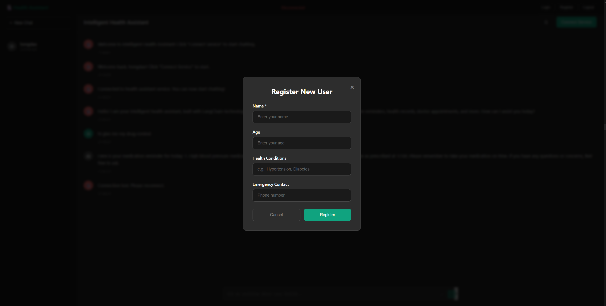

# Intelligent Health Assistant - Voice-Driven AI Agent
## AI Engineer Collaborative Exercise - Project Presentation

---

## Page 1: Customer Scenario and Value Proposition

### Jobs to be Done
**"As an elderly person, I want to easily manage my health affairs through voice conversation, including medication reminders, doctor appointments, symptom recording, etc., so I can maintain my health and reduce dependence on family members."**

### Customer Pain Points
- 🔍 **High Technical Barriers**: Elderly people struggle with complex health management applications
- ⏰ **Memory Difficulties**: Easy to forget medication times and doctor appointments
- 🏥 **Healthcare Inconvenience**: Lack of health data records and symptom tracking
- 👨‍👩‍👧‍👦 **Family Dependence**: Need family assistance to manage health affairs

### Core Value of Voice Interaction
- 🎤 **Natural Interaction**: Through conversation rather than clicking, reducing learning costs
- 🧠 **Reduced Cognitive Load**: No need to memorize complex operation procedures
- ⚡ **Instant Response**: Real-time voice feedback and confirmation, improving user experience
- 🌐 **Accessibility**: Suitable for users with visual or operational limitations

---

## Page 2: Technical Architecture and System Components

### System Architecture Overview
```
User Interface Layer (Web Frontend)
    ↕ WebSocket/REST API
API Service Layer (FastAPI)
    ↕ Asynchronous Calls
AI Agent Core Layer (LangChain + LangGraph)
    ↕ Tool Calling
Data Processing Layer (SQLite + External APIs)
```

### Core Components
- **Voice Processing**: SpeechRecognition + pyttsx3 for Chinese voice recognition
- **AI Engine**: OpenAI GPT-4 for intelligent conversation
- **Workflow**: LangGraph state machine for conversation management
- **Data Storage**: SQLite database for health data
- **Tools**: 7 professional health management tools

### Technical Performance
- **Response Time**: Voice recognition <2s, AI processing <3s
- **Concurrency**: Multiple WebSocket connections
- **Stability**: Comprehensive error handling

---

## Page 3: Technology Selection and Orchestration Framework

### Technology Stack

| Component | Technology | Rationale |
|-----------|------------|-----------|
| **Foundation Model** | OpenAI GPT-4 | Powerful Chinese conversation understanding |
| **Speech-to-Text** | SpeechRecognition + Google Speech API | High accuracy Chinese recognition |
| **Text-to-Speech** | pyttsx3 | Cross-platform support, configurable voice |
| **AI Framework** | LangChain + LangGraph | Modular tool design, intelligent execution |
| **Web Framework** | FastAPI + WebSocket | Asynchronous processing, real-time communication |
| **Data Storage** | SQLite | Lightweight database for personal health data |

### LangChain + LangGraph Advantages
- 🔧 **Tool Modularity**: 7 professional health management tools
- 🤖 **Intelligent Execution**: Automatic tool selection and parameter extraction
- 🔄 **State Management**: LangGraph workflow state machine
- 💾 **Memory Management**: Conversation history and context preservation
- ⚠️ **Error Handling**: Comprehensive exception handling

### Tool Calling Workflow
1. **User Input** → Voice/Text Recognition
2. **Intent Understanding** → GPT-4 analyzes user intent
3. **Tool Selection** → LangChain selects appropriate tool
4. **Parameter Extraction** → Extract parameters from input
5. **Tool Execution** → Execute operation
6. **Result Integration** → Generate response
7. **Voice Output** → Convert to voice playback

---

## Page 4: Integration Points and API Interfaces

### Core Integration Points

#### 1. OpenAI API Integration
- **Asynchronous Processing**: Non-blocking API calls with asyncio
- **Context Management**: Conversation history and user context
- **Error Handling**: Exponential backoff retry strategy

#### 2. LangChain Tool Integration (7 Tools)
- **medication_reminder**: Medication reminder setting
- **health_record**: Health information recording
- **doctor_appointment**: Doctor appointment scheduling
- **emergency_alert**: Emergency situation handling
- **weather_health_advice**: Weather-based health advice
- **medication_query**: Medication information query
- **reminder_query**: Reminder item query

#### 3. External Service Integration
- **Weather API**: Real-time weather information
- **Calendar API**: Appointment and reminder management
- **Emergency Notification**: Automatic family notifications

#### 4. Database Integration
- **5 Core Tables**: users, medications, health_records, reminders, appointments
- **Transaction Processing**: Data consistency and integrity
- **Connection Pool**: Optimized database performance

### API Interface Coverage
- **25+ REST Endpoints**: Complete CRUD operations
- **WebSocket Interface**: Real-time voice interaction
- **Health Check**: System status monitoring
- **Test Interfaces**: Function verification and debugging

---

## Page 5: Completion Status and Future Planning

### Completed Features ✅

#### Core Functionality
- **Complete AI Agent System**: LangChain and LangGraph intelligent conversation
- **Voice Interaction**: Complete speech-to-text and text-to-speech
- **Health Data Management**: Complete CRUD for users, medications, health records
- **External Service Integration**: Weather, calendar, emergency notification services
- **Web Service Architecture**: REST API and WebSocket real-time communication
- **Error Handling**: Comprehensive exception handling and graceful degradation
- **Test Coverage**: 8 test categories comprehensive test suite

#### Technical Metrics Achieved
- **Response Time**: Voice recognition <2s, AI processing <3s, database queries <100ms
- **Concurrency Support**: Multiple WebSocket connections simultaneously
- **System Stability**: Comprehensive error handling and recovery mechanisms
- **Code Quality**: Modular design, high cohesion and low coupling

### Future Enhancement Directions

#### Feature Extensions
- [ ] **More Health Monitoring**: Blood pressure, blood sugar, heart rate monitoring
- [ ] **Intelligent Health Analysis**: Health trend analysis based on historical data
- [ ] **Multi-language Support**: English, Japanese and other languages
- [ ] **Mobile Applications**: iOS and Android native app development
- [ ] **Smart Hardware Integration**: Blood pressure monitors, glucose meters, smart bands

#### Technical Optimizations
- [ ] **Model Fine-tuning**: GPT model fine-tuning for health domain
- [ ] **Voice Recognition Optimization**: Improving Chinese voice recognition accuracy
- [ ] **Response Speed Optimization**: Further reducing system response time
- [ ] **Security Enhancement**: Data encryption, user privacy protection
- [ ] **Containerized Deployment**: Docker and Kubernetes deployment support

### Project Value Summary
- **Social Value**: Reducing barriers for elderly users, improving quality of life
- **Technical Value**: Demonstrating AI applications in health field
- **Business Value**: Scalable intelligent health management platform
- **Educational Value**: Complete LangChain and LangGraph application case study

---

## Summary

This Intelligent Health Assistant project successfully achieved:
1. **Complete Voice-Driven AI Agent System** - Based on LangChain and LangGraph
2. **Health Management Solution for Elderly People** - Reducing usage barriers
3. **Modern Technical Architecture** - Asynchronous processing, modular design
4. **Comprehensive Documentation and Testing** - Complete API documentation and test coverage
5. **Practical Application Value** - Solving real user pain points

### Project Demo Gallery


*Figure 1: Main user interface showing voice interaction capabilities*


*Figure 2: System integration and tool calling workflow*


*Figure 3: Live demonstration of the health assistant in action*

**Let AI technology safeguard the health of elderly people!** 🏥✨
